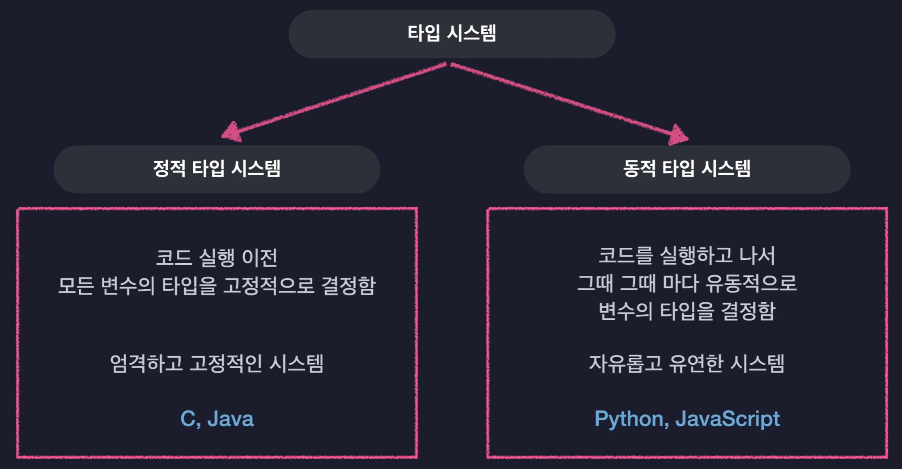

> 해당 블로그 글은 '한 입 크기로 잘라먹는 타입스크립트(TypeScript)' 강의를 수강하며 작성했습니다. 
> 강의 링크: https://biz.inflearn.com/course/%ED%95%9C%EC%9E%85-%ED%81%AC%EA%B8%B0-%ED%83%80%EC%9E%85%EC%8A%A4%ED%81%AC%EB%A6%BD%ED%8A%B8?cid=330452&srsltid=AfmBOoqdu-zPblV_hZ-FkygJfPiwtazZkZMz_RL6S1NSgFJfWSaCQBXq

개인적으로는 같은 시리즈의 리액트 강의를 잘 들었었기 때문에 선택했다. 
최근 프로젝트를 거의 TS를 이용해서 진행하고 잇는데 막상 TS를 잘 하진 못해서... 자기주도학습지원으로 ㅎㅎ...

# 타입스크립트 개요 

## 타입스크립트 소개 
- C3이랑 유사 
- 오픈소스 
- JS 개발자 사이에서 인기 
- JS를 더 안전하게 사용할 수 있도록 여러 기능을 추가한 언어 -> 타입을 더 안전하게 사용할 수 있도록
- JS의 기본 문법은 전부 사용할 수 있다 
- 자바스크립트는 유연한 문법을 가지고 간단한 프로그램을 쉽게 만드는 언어였음 -> Node.js같은걸 이용해서 더 다양한 분야에서 사용하게 되다 보니 유연한 문법이 리스크가 됨 -> 타입이라는 안전장치 추가 

### 자바스크립트의 한계 

- 동적 타입 시스템: 변수의 타입이 하나로만 고정되지 않음 -> 아무 타입이나 담을 수 있음 
- 단 그것 때문에 오류가 발생하는 경우가 있음 -> 그러나 실행은 된다!
- 즉 오류가 발생하는 코드를 사전에 방지할 수 없음 
- 정적 타입 시스템을 가진 언어들은 이런 문제가 발생하지 않는다 -> 실행 전에 에디터상에서 타입 오류 확인 가능 

타입스크립트: 동적 타입과 정적 타입을 혼합한 느낌의 독특한 시스템 
- 변수에 담기는 초기값을 기준으로 알아서 타입을 추론한다
-> 점진적 타입 시스템

## 타입스크립트의 동작 원리 

1) 코드 -> AST 변환
2) AST 기반 타입 검사 진행 -> 실패하면 컴파일 종료
3) AST를 자바스크립트로 변환 
4) JS가 다시 AST, 바이트코드를 거쳐 실행 

## 타입스크립트 실습 
- 처음엔 `npm init` 필요 
- `@types/node` 패키지 필요 
- `npm install typescript`를 통해 컴파일러 설치 필요 -> 버전확인은 `tsc -v`
- `tsx`를 쓰면 한번에 실행할 수 있다

